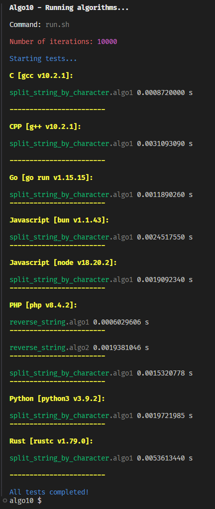

# Algo10

Algorithm studies.

Algo10 is a great repo to find that algorithm, compare its variations and compare performance with other languages.

## Algorithms

- split_string_by_character
- reverse_string

## Project Structure

Below is an example of how algorithms are structured in directories and files.

```txt
algo10/
├── C/
│   ├── Benchmark.h
│   ├── Benchmark.c
│   ├── split_string_by_character.algo1.c
│   ├── split_string_by_character.algo2.c
│   └── ...Other algorithms or variations of the same algorithm here...
├── CPP/
│   ├── Benchmark.h
│   ├── split_string_by_character.algo1.cpp
│   ├── split_string_by_character.algo2.cpp
│   └── ...Other algorithms or variations of the same algorithm here...
├── Go/
│   ├── Benchmark.go
│   ├── split_string_by_character.algo1.go
│   └── ...Other algorithms or variations of the same algorithm here...
├── PHP/
│   ├── Benchmark.php
│   ├── split_string_by_character.algo1.php
│   ├── split_string_by_character.algo2.php
│   └── ...Other algorithms or variations of the same algorithm here...
├── Javascript/
│   ├── Benchmark.js
│   ├── split_string_by_character.algo1.js
│   ├── split_string_by_character.algo2.js
│   └── ...Other algorithms or variations of the same algorithm here...
├── Python/
│   ├── Benchmark.py
│   ├── split_string_by_character.algo1.py
│   ├── split_string_by_character.algo2.py
│   └── ....Other algorithms or variations of the same algorithm here...
├── Rust/
│   ├── Benchmark.rs
│   ├── split_string_by_character.algo1.rs
│   └── ...Other algorithms or variations of the same algorithm here...
└── README.md
```

## Rules

1. Language names like folders in the root folder start with a capital letter.
2. Algorithm names MUST be identical across all languages.
3. Each algorithm can have multiple implementations (variations)
4. Variations of algorithms are identified with the suffix `.algo` + `n` in file name, where `n` is the number of the algorithm variation.
5. Each language MUST have its own Benchmark module.
6. The Benchmark module file name for each language MUST start with an uppercase letter: `Benchmark`.
7. All implementations MUST include benchmarks for performance comparison.
8. Benchmark modules MUST implement loops for iterations.
9. Algorithms can have a maximum of 10 variations.

### File Naming Convention

- Use snake_case for algorithm names.
- Keep names simple and descriptive. You should be able to identify exactly what the algorithm does by the file name.
- Always use English terms.
- File pattern: `<language_name>/<algorithm_name>.algo<variation_number>.<extension>`

## Scope

### Supported Languages

- C
- CPP
- Go
- Javascript
- PHP
- Python
- Rust

Feel free to add other languages.

### Supported Runtimes

#### Javascript

- Bun
- NodeJS

Feel free to add other runtimes.

## Running Tests

```bash
bash run.sh [args] [options]
```

### Args

- `<algorithm_name>`: Name of the algorithm to be executed.
- `<algorithm_index>`: Index of the algorithm in the list to be executed.
- `<algorithm_name>.algo<variation_number>`: Name of the algorithm with specific variation to be executed.

### Options

- `--iterations <number>`: Sets the number of iterations for the benchmarks (default: 10000).
- `--language <language>`: Filters the tests for a specific language.

### Output example

```bash
bash run.sh --iterations 1000
# bash run.sh 1 --iterations 10000
# bash run.sh split_string_by_character --iterations 10000
# bash run.sh split_string_by_character.algo1 --iterations 10000
# bash run.sh --language PHP
# ...
```


